```{r setup, include=FALSE}
knitr::opts_chunk$set(echo = TRUE)
```


```{r libs,include=FALSE}
library(rmdformats)
library(prettydoc)
library(Hmisc)
library(knitr)
library(readxl)
library(foreign)
library(tidyverse)
library(ggmap)
library(rgdal)
library(tidytext)
library(RcppMeCab)
library(ggpubr)
library(showtext)
library(extrafont)
font_add("nanum","NanumGothic.ttf")
showtext_auto()

```

# Summary

> 2023년 7월-9월에 게시된 네이버 환경뉴스를 분석한 결과 환경오염물질 배출, 후쿠시마 원전 오염수 방류, 하절기 극단적 기후 현상, 기후변화, 탄소중립 관련 키워드가 빈번하게 출현하였다.같은 시기 환경무 문헌의 키워드에서는 환경오염물질 배출, 기후변화, 탄소중립 관련 키워드가 빈번하게 출현하여 후쿠시마 원전 오염수 방류를 제외한 이슈에 대해서는 네이버 환경뉴스 키워드와 조응하는 경향이 있었다. 같은 시기 환경부 문헌에서는 자연환경 (7월,9월) 관련 키워드 및 환경정책 관련 키워드(7월, 8월, 9월)가 빈번하게 출현하였으나, 네이버 환경뉴스에서는 이와 관련된 키워드가 빈번하게 출현하지 않았다.  

* [7월 텍스트 분석 바로가기](#텍스트분석-july)

* [8월 텍스트 분석 바로가기](#텍스트분석-august)

* [9월 텍스트 분석 바로가기](#텍스트분석-september)

>2023년 7월 1주차에는 chlorophyll-a 예측치가 25$\mu g/m^3$ 이상이어서 녹조 농도가 높을 것으로 예측되는 측정소는 '곡교천2, 논산천4,금호강8,구포,학성,남강7,남지' 측정소이다. 2023년 8월 1주차에는 chlorophyll-a 예측치가 25$\mu g/m^3$ 이상이어서 녹조 농도가 높을 것으로 예측되는 측정소는 존재하지 않았다.

* [8월 녹조 예측 바로가기](#녹조예측-august)

* [9월 녹조 예측 바로가기](#녹조예측-september)


>2022년 8월까지 오존($O_3$)을 제외한 대기오염물질 오염도는 2010년 이후 지속적인 하락추세를 유지하였고, 2022년 까지 평균기온은 1970년 이후의 상승세를 유지하였다. 2014-2022년 간 광역자치단체 단위 PM10 농도와 1인당 소비 및 평균소비성향간의 관계를 분석한 결과, PM10의 농도와 소비와의 관계는 일률적이지 않았다. 1인당 소비는 PM10 농도와 약한 음의 상관관계가 있었지만, 평균소비성향과는 약한 양의 상관관계가 있었다. 

> 2022년까지 기온 변화를 반영하면 평균기온은 2023년 섭씨 13.14에서 2025년 섭씨 13.21로 상승할 전망이다. 온실가스 배출량은 2019년, 2020년 2년에 걸쳐 감소하였으며, GDP 대비 배출량은 2012년 이후 지속된 감소 추세를 2019년, 2020년에도 유지하였다. 그러나 장기적으로 1990낸 대비 2018년 한국의 온실가스 배출량은 154.9\% 증가하여 같은 기간 세계 온실가스 배출량 증가율 56.73\%를 크게 상회하였다.

* [8월 대기오염,기후변화,탄소중립 질문기반DB 바로가기](#질문기반db-august)

* [9월 대기오염,기후변화,탄소중립 질문기반DB 바로가기](#질문기반db-september)

# 7월 환경 빅데이터 뉴스레터

##  1. 텍스트분석 JULY 

* 한국환경연구원 텍스트 수집 도구는 2023년 7월 30일까지 네이버 기사 데이터와 환경부 문헌 데이터를 제공한다. 아래 뉴스레터에서는 2023년 7월 1일을 기점으로 30일 이전까지 수집한 자료를 사용한다. 


#### A. Text 데이터


분석 대상 Text Data는 다음 두 종류의 문헌을 자료이다. 


1. NAVER 환경 뉴스 : 2023년 7월 1일-2023년 7월 30일 NAVER 뉴스> '사회' >'환경' 부문에 게시된 뉴스
2. 환경부 문건 : 2023년 7월 1일-2023년 7월 30일 환경부홈페이지에 게시된 환경부 보도자료 및 e-환경뉴스

'NAVER 환경 뉴스'는 환경정책의 수요자인 국민의 환경과 관련된 관심사를 전달하는 텍스트 자료이다. 그리고 '환경부 문건'은 환경정책의 공급자인 환경부의 관심사를 전달하는 텍스트 자료이다. 이 두 자료의 키워드를 비교하여 환경정책 공급자의 관심사가 환경정책 수요자의 관심사에 조응하는지 여부를 점검한다.

#### B. 키워드 빈도분석

 한국환경연구원의 환경 빅데이터 플랫폼에서는 키워드를 단순빈도수 및 TF_IDF 값에 따라 추출한다. 키워드 추출 전단계로 파이선'konlpy'패키지를 활용한 형태소 분석 및 품사 태깅을 수행하고, 불용어(stopwords)를 제거한다.  2023년 7월 1일 - 7월 30일 게시 NAVER 환경뉴스 및 환경부 문건에서 단순빈도수가 높은 20개의 키워드를 추출한 결과는 아래 그림과 같다. 

<!-- <center> -->
<!--  -->
<!-- </center> -->


```{r readdata07, echo=FALSE}
NAVER_TF=read.csv("./Data/2023_07_31/2023-07-30_30_NN_TF.txt",
                  encoding="UTF-8",
                  row.names=NULL,
                  header=FALSE)[,-1]


NAVER_TFIDF=read.csv("./Data/2023_07_31/2023-07-30_30_NN_norm_TF.txt",
                  encoding="UTF-8",
                  row.names=NULL,
                  header=FALSE)[,-1]

ME_TF=read.csv("./Data/2023_07_31/2023-07-30_30_ME_TF.txt",
               encoding="UTF-8",
               row.names=NULL,
               header=FALSE)[,-1]

ME_TFIDF=read.csv("./Data/2023_07_31/2023-07-30_30_ME_norm_TF.txt",
               encoding="UTF-8",
               row.names=NULL,
               header=FALSE)[,-1]

colnames(NAVER_TF)=c("키워드","빈도수")

colnames(NAVER_TFIDF)=c("키워드","TFIDF")

colnames(ME_TF)=c("키워드","빈도수")

colnames(ME_TFIDF)=c("키워드","TFIDF")

NAVER_TF=tibble(NAVER_TF)
ME_TF=tibble(ME_TF)
NAVER_TFIDF=tibble(NAVER_TFIDF)
ME_TFIDF=tibble(ME_TFIDF)


```


```{r fig07,showtext=TRUE,echo=FALSE, warning =FALSE}
P_NAVFQ=NAVER_TF%>% head(n=20) %>%ungroup() %>% 
  ggplot(aes(x=`빈도수`,y=reorder(`키워드`,`빈도수`))) + 
  geom_col(show.legend=FALSE) +
  ggtitle("NAVER 환경뉴스")+ labs(y="")+
  geom_text(aes(label=`빈도수`),size=3.5,nudge_x = 18)+
  theme_grey(base_family = "nanum")
#print(P_NAVFQ)

P_MEFQ=ME_TF %>%  head(n=20) %>%ungroup() %>% 
  ggplot(aes(x=`빈도수`,y=reorder(`키워드`,`빈도수`))) + 
  geom_col(show.legend=FALSE) + 
  ggtitle("환경부 문건")+ labs(y="")+
  geom_text(aes(label=`빈도수`),size = 3.5,nudge_x = 3)+
  theme_grey(base_family = "nanum")


P_FQ=ggarrange(P_NAVFQ,P_MEFQ,ncol=2,nrow=1)

print(P_FQ)

```


눈에 띄는  차이는 두 가지로 정리할 수 있다.  

* 첫째, 네이버 환경뉴스에는 빈도수가 높은 상위 20개 키워드 중 '오염수','후쿠시마','오염수 방류','방류' 등 후쿠시마 제1원자력발전소 오염수 방류와 관련된 키워드가 발견되었지만 환경부 문건의 빈도수 상위 20개 키워드에는 이에 상응하는 키워드가 발견되지 않았다.

* 둘째, 네이버 환경뉴스에는 빈도수가 높은 상위 20개 키워드 중 '폭염','호우','폭우','장맛비','기후','장마' 등 장마철 이상기후 현상과 관련된 키워드가 다수 발견되었으며, 환경부 문건의 빈도수 상위 20개 키워드 중에서는 '안전','하천',''홍수','기후' 등 이상기후 현상에 대한 민간의 관심에 조응하는  키워드가 발견되었다.

* 셋째, 환경부 문건의 빈도수 상위 20개 키워드 중에는 '국립공원','생물다양성','생태','생물','보전' 등 자연환경 관련 키워드, 그리고 '녹색','규제','협약' 등 환경정책과 관련된 키워드가 포함되지만 네이버 환경뉴스에서는 이에 상응하는 키워드가 발견되지 않았다. 


```{r TFIDFFIGURE07, message=FALSE, echo=FALSE, warning =FALSE}

P_NAVTFIDF=NAVER_TFIDF%>% head(n=20) %>%ungroup() %>% 
  ggplot(aes(x=TFIDF,y=reorder(`키워드`,TFIDF))) + 
  geom_col(show.legend=FALSE) + 
  ggtitle("NAVER 환경뉴스")+ labs(y="")+
  geom_text(aes(label=round(TFIDF,1)),size=3.5, nudge_x=2)
#+
  #theme_grey(base_family = "nanum")+ 
  #theme(text = element_text(size = 12)) 

P_METFIDF=ME_TFIDF %>%  head(n=20) %>%ungroup() %>% 
  ggplot(aes(x=TFIDF,y=reorder(`키워드`,TFIDF))) + 
  geom_col(show.legend=FALSE) + 
  ggtitle("환경부 문건")+ labs(y="")+
  geom_text(aes(label=round(TFIDF,1)),size=3.5, nudge_x=0.2)
#+
  #theme_grey(base_family = "nanum")+ 
  #theme(text = element_text(size = 12)) 


P_TFIDF=ggarrange(P_NAVTFIDF,P_METFIDF,ncol=2,nrow=1)
#P_TFIDF2=annotate_figure(P_TFIDF,
               #top = text_grob("Visualizing Tooth Growth", color = "red", face = "bold", size = 14),
#               bottom = text_grob("그림 2. TFIDF 키워드 순위 비교", x=0.2)#hjust = 1, x = 1),
               #left = text_grob("Figure arranged using ggpubr", color = "green", rot = 90),
               #right = text_grob(bquote("Superscript: ("*kg~NH[3]~ha^-1~yr^-1*")"), rot = 90),
               #fig.lab = "Figure 1", fig.lab.face = "bold"
#)


print(P_TFIDF)
#ggsave(file="P_TFIDF_220929_7.png",P_TFIDF)
#ggsave(file="P_NAVTFIDF.png",P_NAVTFIDF)
#ggsave(file="P_METFIDF.png",P_METFIDF)

```

<!-- <center> -->
<!--  -->
<!-- </center> -->


이와 같은 경향은 TF_IDF 값이 높은 20개의 키워드를 추출하여 비교하여도 확인된다. Figure 2는 TF_IDF를 기준으로 추출한 상위 20개 키워드의 TF_IDF 값을 보여준다. Figure 2에서도 확인할 수 있듯이 

* '오염수','방류','후쿠시마','원전'과 같은 키워드는 NAVER 뉴스에서만 찾아볼 수 있다.

* '국립공원','생물다양성','생태','생물'과 같이 자연환경과 관련된 키워드 및 '규제','녹색','협약' 등 환경정책 관련 문헌에서 자주 사용되는 키워드는 환경부 문건에서만 찾아 볼 수 있다.

* '장맛비', '폭우','폭염','호우','장마','무더위'와 같은 NAVER 뉴스의 키워드와 '하천','홍수' 와 같은 환경부 문건의 키워드는 여름철 이상기후 현상에 대한 민간의 관심과 환경부의 관심이 상호 일치함을 보여준다. 

#### C. 키워드 관련 뉴스


네이버 환경뉴스 키워드와 환경부 문건 키워드간의 차이의 원인을 파악하기 위해서 두 문헌에서 단순빈도가  가장 높은 10개 키워드 중 서로 상이한 키워드가 포함된 문헌의 제목들을 비교하였다. 

* 네이버 환경뉴스에서 단순빈도가 높은 10개 키워드 중 환경부 문건의 단순빈도가 높은 20개 키워드에 포함되지 않은 키워드는 [`r setdiff(NAVER_TF$키워드[1:10],ME_TF$키워드[1:20])`]이다. 

* 환경부 문헌에서 단순빈도가 높은 10개 키워드 중 네이버 환경뉴스에서  단순빈도가 높은 20개 키워드에 포함되지 않은 키워드는 [`r setdiff(ME_TF$키워드[1:10],NAVER_TF$키워드[1:20])`]이다.


```{r titleload07, echo=FALSE, warning =FALSE}
#library(readxl)
#read_excel
#TITLE_NN_7=read.csv("./Data/2022-09-29_7_NN_idx.txt",header=FALSE) 
#TITLE_ME_7=read.csv("./Data/2022-09-29_7_ME_idx.txt",header=FALSE) 
#TITLE_NN_14=read.csv("./Data/2022-09-29_14_NN_idx.txt",header=FALSE) 
#TITLE_ME_14=read.csv("./Data/2022-09-29_14_ME_idx.txt",header=FALSE) 
TITLE_NN_30=read.csv("./Data/2023_07_31/2023-07-30_30_NN_idx.txt",header=FALSE) 
TITLE_ME_30=read.csv("./Data/2023_07_31/2023-07-30_30_ME_idx.txt",header=FALSE) 

# TITLE_NN_7$GAP=7
# TITLE_ME_7$GAP=7
# 
# TITLE_NN_14$GAP=14
# TITLE_ME_14$GAP=14

TITLE_NN_30$GAP=30
TITLE_ME_30$GAP=30

TITLE_NN=TITLE_NN_30 %>% select(c("V3","GAP")) %>% mutate(SOURCE="NAVER")
TITLE_ME=TITLE_ME_30 %>% select(c("V3","GAP")) %>% mutate(SOURCE="ME")
TITLES =rbind(TITLE_NN,TITLE_ME)
colnames(TITLES)=c("Title","GAP","SOURCE")
```

1. '오염수'를 제목에 포함하는 기사들은 후쿠시마 제1원자력발전소 오염수 방류와 관련된 기사로 파악되었다. '방류','후쿠시마 오염수','후쿠시마', '오염수 방류','일본'을 제목에 포함하는 기사도 유사한 성향의 기사들이었다.

```{r title107, echo=FALSE, warning =FALSE}
#TITLES=read_excel("./Data/titles_20230417.xlsx",sheet=1)
#TITLES=TITLES %>% mutate(ID=1) %>% group_by(KEY) %>% mutate(SE=cumsum(ID)) %>% filter(SE<=3)
R1=TITLES %>% filter(SOURCE=="NAVER") %>%
  filter(GAP==30) %>%
  #filter(str_detect(Title,"오염수")) %>%
  filter(str_detect(Title,"오염수")|
           str_detect(Title,"방류")|
           str_detect(Title,"일본")) %>%
  select(Title) %>% head(10)

kable(R1)

```


환경부 문헌에서 가장 빈도가 높은 10개 키워드 중 네이버 뉴스에서 가장 빈도가 높은 키워드 20개에 포함되지 않은 키워드는 '온실가스','배출','협약','녹색','국립공원', '기후변화','하천','규제'이다.  이 중 '온실가스','배출','기후변화'는 네이버 뉴스의 키워드 중 온실가스 배출과 관련된 관심을 나타내는 '탄소'와 조응하고, '하천'은 여름철 이상기후 현상에 대한 관심을 나타내는 '폭우','호우'와 조응한다. 반면 '협약','녹색','국립공원','규제'는 네이버 뉴스에서 빈도가 높은 키워드 20개 중에 조응하는 키워드를 찾기 어렵다. '2023년 7월 1일부터 7 30일까지 게시된 환경부 문헌 중 이들 키워드를 제목에 포함하는 환경부 문헌은 다음과 같다. 

1. '녹색'을 제목에 포함하는 문헌들은 모두 녹색산업과 관련된 문헌이었다. 
```{r titleME107, echo=FALSE, warning =FALSE}
R1_ME=TITLES %>% filter(SOURCE=="ME") %>%
  filter(GAP==30) %>%
  filter(str_detect(Title,"녹색")) %>%
  select(Title)
kable(R1_ME)

```


2. '규제'을 제목에 포함하는 문헌들은 기업의 환경규제 부담 완화 혹은 국제규제 대응 관련 문헌으로 파악되었다. 
```{r titleME207, echo=FALSE, warning =FALSE}
R1_ME=TITLES %>% filter(SOURCE=="ME") %>%
  filter(GAP==30) %>%
  filter(str_detect(Title,"규제")) %>%
  select(Title)
kable(R1_ME)

```
3. '국립공원'를 제목에 포함하는 문헌들은 하절기 국립공원 안전 관련 2건, 국립공원 해양 기후변화 연구시설 개소 관련 문헌이 1건 있었다..

```{r titleME307, echo=FALSE, warning =FALSE}
R2_ME=TITLES %>% filter(SOURCE=="ME") %>%
  filter(GAP==30) %>%
  filter(str_detect(Title,"국립공원")) %>%
  select(Title)
kable(R2_ME)

```
4. '협약' 을 제목에 포함하는 문헌은 존재하지 않았다.
```{r titleME407, echo=FALSE, warning =FALSE}
R3_ME=TITLES %>% filter(SOURCE=="ME") %>%
  filter(GAP==30) %>%
  filter(str_detect(Title,"협약")
         #|str_detect(Title,"순환")
         ) %>%
  select(Title)
kable(R3_ME)

```


#### D. 정리

2023년 7월 1일-2023년 7월 30일 게시된 네이버 환경뉴스와 환경부 문헌을 비교한 결과를 요약하면 다음과 같다.

1. 네이버 기사로부터 후쿠시마 원자력발전소의 오염수 방류에 대한 국민들의 관심이
많은데 이와 관련된 환경부 문건의 비중은 낮은 것으로 파악되었다.   

2. 네이버 기사와 환경부 문헌 모두 여름철 이상기후 현상인 호우 및 폭염과 관련된 키워드가 다수 발견되었다. 이는 7월 집중호우와 관련하여 민간의 관심 및 환경부의 관심이 모두 높았음을 시사한다.

3. 환경부 문헌으로부터 이 당시 환경부는 녹색산업 육성, 환경규제 부담 완화, 국립공원 안전 강화 등의 정책을 추진하였음을 알 수 있다. 이들 정책 중 녹색산업 육성은 NAVER 뉴스에서 빈도가 높았던 '탄소' 관련 관심에 조응하는 정책이라고 할 수 있다. 그러나 이외의 정책은 NAVER 뉴스의 관심을 얻지 못하였다. 

\newpage

# 8월 환경 빅데이터 뉴스레터 

##  1. 텍스트분석 AUGUST 

* 한국환경연구원 텍스트 수집 도구는 2023년 8월 31일까지 네이버 기사 데이터와 환경부 문헌 데이터를 제공한다. 아래 뉴스레터에서는 2023년 8월 2일을 기점으로 31일 이전까지 수집한 자료를 사용한다. 


#### A. Text 데이터  


분석 대상 Text Data는 다음 두 종류의 문헌을 자료이다. 


1. NAVER 환경 뉴스 : 2023년 8월 2일-2023년 8월 31일 NAVER 뉴스> '사회' >'환경' 부문에 게시된 뉴스
2. 환경부 문건 : 2023년 8월 2일-2023년 8월 31일 환경부홈페이지에 게시된 환경부 보도자료 및 e-환경뉴스

'NAVER 환경 뉴스'는 환경정책의 수요자인 국민의 환경과 관련된 관심사를 전달하는 텍스트 자료이다. 그리고 '환경부 문건'은 환경정책의 공급자인 환경부의 관심사를 전달하는 텍스트 자료이다. 이 두 자료의 키워드를 비교하여 환경정책 공급자의 관심사가 환경정책 수요자의 관심사에 조응하는지 여부를 점검한다.

#### B. 키워드 빈도분석

 한국환경연구원의 환경 빅데이터 플랫폼에서는 키워드를 단순빈도수 및 TF_IDF 값에 따라 추출한다. 키워드 추출 전단계로 파이선'konlpy'패키지를 활용한 형태소 분석 및 품사 태깅을 수행하고, 불용어(stopwords)를 제거한다.  2023년 8월 2일 - 8월 31일 게시 NAVER 환경뉴스 및 환경부 문건에서 단순빈도수가 높은 20개의 키워드를 추출한 결과는 아래 그림과 같다. 

```{r readdata, echo=FALSE}
NAVER_TF=read.csv("./Data/2023_08_31/2023-08-31_30_NN_TF.txt",
                  encoding="UTF-8",
                  row.names=NULL,
                  header=FALSE)[,-1]


NAVER_TFIDF=read.csv("./Data/2023_08_31/2023-08-31_30_NN_norm_TF.txt",
                  encoding="UTF-8",
                  row.names=NULL,
                  header=FALSE)[,-1]

ME_TF=read.csv("./Data/2023_08_31/2023-08-31_30_ME_TF.txt",
               encoding="UTF-8",
               row.names=NULL,
               header=FALSE)[,-1]

ME_TFIDF=read.csv("./Data/2023_08_31/2023-08-31_30_ME_norm_TF.txt",
               encoding="UTF-8",
               row.names=NULL,
               header=FALSE)[,-1]

colnames(NAVER_TF)=c("키워드","빈도수")

colnames(NAVER_TFIDF)=c("키워드","TFIDF")

colnames(ME_TF)=c("키워드","빈도수")

colnames(ME_TFIDF)=c("키워드","TFIDF")

NAVER_TF=tibble(NAVER_TF)
ME_TF=tibble(ME_TF)
NAVER_TFIDF=tibble(NAVER_TFIDF)
ME_TFIDF=tibble(ME_TFIDF)


```

```{r fig, showtext=TRUE,echo=FALSE, warning =FALSE}
P_NAVFQ=NAVER_TF%>% head(n=20) %>%ungroup() %>% 
  ggplot(aes(x=`빈도수`,y=reorder(`키워드`,`빈도수`))) + 
  geom_col(show.legend=FALSE) +
  ggtitle("NAVER 환경뉴스")+ labs(y="")+
  geom_text(aes(label=`빈도수`),size=3.5,nudge_x = 18)+
  theme_grey(base_family = "nanum")
#print(P_NAVFQ)

P_MEFQ=ME_TF %>%  head(n=20) %>%ungroup() %>% 
  ggplot(aes(x=`빈도수`,y=reorder(`키워드`,`빈도수`))) + 
  geom_col(show.legend=FALSE) + 
  ggtitle("환경부 문건")+ labs(y="")+
  geom_text(aes(label=`빈도수`),size = 3.5,nudge_x = 3)+
  theme_grey(base_family = "nanum")


P_FQ=ggarrange(P_NAVFQ,P_MEFQ,ncol=2,nrow=1)

print(P_FQ)

```


눈에 띄는 특징은 다음과 같이 정리할 수 있다.  

* 첫째, 네이버 환경뉴스에는 빈도수가 높은 상위 20개 키워드 중 '태풍','카눈','폭염'과 같이 하절기 극단적 기후현상과 관련된 키워드가 다수 발견되었다. 환경부 문건의 빈도수 상위 20개 키워드 중에도 '홍수' 와 같이 이에 상응하는 키워드가 발견되었다. 그리고 네이버 뉴스의 '일본' 키워드는 일본이 태풍 카논의 경로에 포함되었기 때문에 '태풍'과 관련된 관심과도 관련이 있었다. 

* 둘째, 네이버 환경뉴스에는 빈도수가 높은 상위 20개 키워드 중 '오염수','일본','중국','방류','후쿠시마','수산물','방사' 가 발견되어 후쿠히마 원전 가동과 관련된 관심이 유지되었음을 시사하였으나, 환경부 문헌에서는 이에 상응하는 키워드는 발견되지 않았다. 

* 셋째, 네이버 환경뉴스에는 빈도수가 높은 상위 20개 키워드 중 '탄소','기후'와 같이 기후변화 관련  키워드가 발견되었으며 환경부 보도자료에도 이에 상응하는 '탄소','탄소 중립','중립','기후','위기','기후위기'와 같은 키워드가 발견되었다. 

* 넷째, 환경부 문건의 빈도수 상위 20개 키워드 중에는 '규제','화학물질','녹색','하천','수소','폐기물,'
생물' 등 다양한 환경정책 관련 키워드와 '협의','협약','기후변화 협약'과 같이 환경정책 추진을 위한 민-관 협력 및 국가간 협력에 대한 키워드가 발견되지만, 네이버 환경뉴스에서는 이에 상응하는 키워드가 발견되지 않았다. 

```{r TFIDFFIGURE, message=FALSE, echo=FALSE, warning =FALSE}

P_NAVTFIDF=NAVER_TFIDF%>% head(n=20) %>%ungroup() %>% 
  ggplot(aes(x=TFIDF,y=reorder(`키워드`,TFIDF))) + 
  geom_col(show.legend=FALSE) + 
  ggtitle("NAVER 환경뉴스")+ labs(y="")+
  geom_text(aes(label=round(TFIDF,1)),size=3.5, nudge_x=2)+
  theme_minimal()
#+
  #theme_grey(base_family = "nanum")+ 
  #theme(text = element_text(size = 12)) 

P_METFIDF=ME_TFIDF %>%  head(n=20) %>%ungroup() %>% 
  ggplot(aes(x=TFIDF,y=reorder(`키워드`,TFIDF))) + 
  geom_col(show.legend=FALSE) + 
  ggtitle("환경부 문건")+ labs(y="")+
  geom_text(aes(label=round(TFIDF,1)),size=3.5, nudge_x=0.2)+
  theme_minimal()

#+
  #theme_grey(base_family = "nanum")+ 
  #theme(text = element_text(size = 12)) 


P_TFIDF=ggarrange(P_NAVTFIDF,P_METFIDF,ncol=2,nrow=1)
#P_TFIDF2=annotate_figure(P_TFIDF,
               #top = text_grob("Visualizing Tooth Growth", color = "red", face = "bold", size = 14),
#               bottom = text_grob("그림 2. TFIDF 키워드 순위 비교", x=0.2)#hjust = 1, x = 1),
               #left = text_grob("Figure arranged using ggpubr", color = "green", rot = 90),
               #right = text_grob(bquote("Superscript: ("*kg~NH[3]~ha^-1~yr^-1*")"), rot = 90),
               #fig.lab = "Figure 1", fig.lab.face = "bold"
#)


print(P_TFIDF)
#ggsave(file="P_TFIDF_220929_7.png",P_TFIDF)
#ggsave(file="P_NAVTFIDF.png",P_NAVTFIDF)
#ggsave(file="P_METFIDF.png",P_METFIDF)

```

이와 같은 경향은 TF_IDF 값이 높은 20개의 키워드를 추출하여 비교하여도 확인된다. Figure 2는 TF_IDF를 기준으로 추출한 상위 20개 키워드의 TF_IDF 값을 보여준다. Figure 2에서도 확인할 수 있듯이 

* '오염수','방류','후쿠시마','일본','원전','중국'과 같은 키워드는 NAVER 뉴스에서만 찾아볼 수 있다.

* '태풍', '카눈','소나기'와 같은 NAVER 뉴스의 키워드와 '태풍'과 같은 환경부 문건의 키워드는 태풍에 대한 민간의 관심과 환경부의 관심이 상호 일치함을 보여준다.

* '기후'와 같은 NAVER 뉴스의 키워드와 '탄소','탄소 중립','중립','기후변화'와 같은 환경부 문건의 키워드는 기후변화에 대한 민간의 관심과 환경부의 관심이 상호 일치함을 보여준다.


* '국립공원'과 같이 자연환경과 관련된 키워드, '규제','화학물질','생물'과 같은 환경정책 관련 키워드, '지하수'와 같은 수자원 관련 키워드, '폐기물','재활용'과 같은 자원순환 관련 키워드, '협의','협약'과 같은 정책협력 관련 키워드는 환경부 문건에서만 찾아 볼 수 있다. 


#### C. 키워드 관련 뉴스


네이버 환경뉴스 키워드와 환경부 문건 키워드간의 차이의 원인을 파악하기 위해서 두 문헌에서 단순빈도가  가장 높은 10개 키워드 중 서로 상이한 키워드가 포함된 문헌의 제목들을 비교하였다. 

* 네이버 환경뉴스에서 단순빈도가 높은 10개 키워드 중 환경부 문건의 단순빈도가 높은 20개 키워드에 포함되지 않은 키워드는 [`r setdiff(NAVER_TF$키워드[1:10],ME_TF$키워드[1:20])`]이다. 이들 중 '태풍','카눈'은 태풍에 관련된 키워드로서 환경부 문헌의 키워드 '홍수'와 연관이 있다. 

* 환경부 문헌에서 단순빈도가 높은 10개 키워드 중 네이버 환경뉴스에서  단순빈도가 높은 20개 키워드에 포함되지 않은 키워드는 [`r setdiff(ME_TF$키워드[1:10],NAVER_TF$키워드[1:20])`]이다.

```{r titleload, echo=FALSE, warning =FALSE}
#library(readxl)
#read_excel
#TITLE_NN_7=read.csv("./Data/2022-09-29_7_NN_idx.txt",header=FALSE) 
#TITLE_ME_7=read.csv("./Data/2022-09-29_7_ME_idx.txt",header=FALSE) 
#TITLE_NN_14=read.csv("./Data/2022-09-29_14_NN_idx.txt",header=FALSE) 
#TITLE_ME_14=read.csv("./Data/2022-09-29_14_ME_idx.txt",header=FALSE) 
TITLE_NN_30=read.csv("./Data/2023_08_31/2023-08-31_30_NN_idx.txt",header=FALSE) 
TITLE_ME_30=read.csv("./Data/2023_08_31/2023-08-31_30_ME_idx.txt",header=FALSE) 

# TITLE_NN_7$GAP=7
# TITLE_ME_7$GAP=7
# 
# TITLE_NN_14$GAP=14
# TITLE_ME_14$GAP=14

TITLE_NN_30$GAP=30
TITLE_ME_30$GAP=30

TITLE_NN=TITLE_NN_30 %>% select(c("V3","GAP")) %>% mutate(SOURCE="NAVER")
TITLE_ME=TITLE_ME_30 %>% select(c("V3","GAP")) %>% mutate(SOURCE="ME")
TITLES =rbind(TITLE_NN,TITLE_ME)
colnames(TITLES)=c("Title","GAP","SOURCE")
```


1. '오염수', '일본','후쿠시마','수산물','원전'을 제목에 포함하는 기사들은 후쿠시마 제1원자력발전소 오염수 방류와 관련된 기사로 파악되었다. 반면 '방류'를 제목에 포함하는 기사들 중에서는 인천시의 참조기 치어 방류와 관련된 기사도 있었다. 아래의 표에서 '태풍' 혹은 '카논'을 제목에 포함한 기사는 제외되었다. 

```{r title1, echo=FALSE, warning =FALSE}
#TITLES=read_excel("./Data/titles_20230417.xlsx",sheet=1)
#TITLES=TITLES %>% mutate(ID=1) %>% group_by(KEY) %>% mutate(SE=cumsum(ID)) %>% filter(SE<=3)
R1=TITLES %>% filter(SOURCE=="NAVER") %>%
  filter(GAP==30) %>%
  #filter(str_detect(Title,"오염수")) %>%
  filter(str_detect(Title,"오염수")|
           str_detect(Title,"방류")|
           str_detect(Title,"일본")|
           str_detect(Title,"후쿠시마")|
           str_detect(Title,"수산물")|
           str_detect(Title,"원전")
           ) %>%
  filter(!(str_detect(Title,"태풍")|
           str_detect(Title,"카눈"))) %>%
  select(Title) %>% 
  head(15)

kable(R1)

```


환경부 문헌에서 가장 빈도가 높은 10개 키워드 중 네이버 뉴스에서 가장 빈도가 높은 키워드 20개에 포함되지 않은 키워드는 '규제','협약','위기','녹색','화학물질','협의','기후변화','국립공원' 이다. 이 중 '기후변화'는 네이버 뉴스의 키워드 중 '기후'에 조응한다. 그 외의 키워드에 조응하는 네이버 뉴스 키워드는 찾아보기 어렵다. 2023년 8월 2일부터 8월 31일까지 게시된 환경부 문헌 중 이들 키워드를 제목에 포함하는 환경부 문헌은 다음과 같다. 

1. '규제','화학물질'을 제목에 포함하는 문헌은 7건으로 2022년 8월에 발표된 환경규제 개선방안의 후속조치 성과를 소개하는 문헌이었다. 
```{r titleME1, echo=FALSE, warning =FALSE}
R1_ME=TITLES %>% filter(SOURCE=="ME") %>%
  filter(GAP==30) %>%
  filter(str_detect(Title,"규제")|str_detect(Title,"화학물질") ) %>%
  #filter(!str_detect(Title,"기후"))%>%
  select(Title)
kable(R1_ME)

```
2. '녹색' 를 제목에 포함하는 문헌은 4건이었는데  2건은 녹색기업, 1건은 오만의 녹색전환, 1건은 인천지역 녹색성장 협력체계와 관련된 문헌이어서 공통된 관심사를 찾기는 어려웠다.

```{r titleME2, echo=FALSE, warning =FALSE}
R1_ME=TITLES %>% filter(SOURCE=="ME") %>%
  filter(GAP==30) %>%
  filter(str_detect(Title,"녹색")) %>%
  #filter(!str_detect(Title,"기후"))%>%
  select(Title)
kable(R1_ME)

```

3. '위기' 를 제목에 포함하는 문건 3건 중 2건은 기후위기와 관련된 문건이어서 역시 네이버 뉴스의 키워드 중 '기후'에 조응한다.  나머지 1건은 멸종위기 생물과 관련된 문건이었다.

```{r titleME3, echo=FALSE, warning =FALSE}
R1_ME=TITLES %>% filter(SOURCE=="ME") %>%
  filter(GAP==30) %>%
  filter(str_detect(Title,"위기")) %>%
  #filter(!str_detect(Title,"기후"))%>%
  select(Title)
kable(R1_ME)

```

4. '협약' 및 '협의' 를 제목에 포함하는 문건은 5건이었는데 그 중 2건은 민-관 업무협약, 2건은 지방자치단체 내부 이해당사자 업무협약과 관련된 문헌이었다. 1건은 유엔기후변화협약 적응주간 행사와 관련된 문헌이었다.


```{r titleME4, echo=FALSE, warning =FALSE}
R1_ME=TITLES %>% filter(SOURCE=="ME") %>%
  filter(GAP==30) %>%
  filter(str_detect(Title,"협약")|str_detect(Title,"협의")) %>%
  #filter(!str_detect(Title,"기후"))%>%
  select(Title)
kable(R1_ME)

```

5. '국립공원'을 제목에 포함하는 문건은 4건이었는데 그 중 2건은 국립공원 이용 안내, 1건은 태풍에 대응하는 국립공원 운영 조정, 1건은 국립공원과 민간의 업무협약 관련 문헌이었다. 이 문헌들에서 일관된 성향을 찾기는 어려웠다.

```{r titleME5, echo=FALSE, warning =FALSE}
R1_ME=TITLES %>% filter(SOURCE=="ME") %>%
  filter(GAP==30) %>%
  filter(str_detect(Title,"국립공원")) %>%
  #filter(!str_detect(Title,"기후"))%>%
  select(Title)
kable(R1_ME)

```

#### D. 정리

2023년 8월 2일-2023년 8월 31일 게시된 네이버 환경뉴스와 환경부 문헌을 비교한 결과를 요약하면 다음과 같다.


1. 네이버 기사에는 후쿠시마 원전 오염수와 관련된 키워드가 출현하였지만 환경부 문헌에서는 이에 조응하는 키워드가 발견되지 않았다. 이는 2023년 7월까지의 키워드 분석 결과와 일관된 결과이다. 

2. 환경부 문헌에는 환경규제 개선, 민관 업무협약 관련 키워드가 출현하였지만 네이버 뉴스에서는 이에 조응하는 키워드가 발견되지 않았다.

3. 네이버 기사와 환경부 문헌 모두 기후변화 및 탄소중립 관련 키워드가 출현하였다. 이는 기후변화와 관련된 민간의 관심과 정부의 개입이 조응하고 있음을 시사한다.


\newpage

##  2. 녹조예측 AUGUST
```{r data, echo=FALSE}
STATIONINFO=read_excel("./predict_chroro/CHARACTER_2023.xlsx",sheet=1)
COVEREDSTATION=STATIONINFO$Kname[!is.na(STATIONINFO$Kname)]

## Data Prep
#1. Read data
CHRORO.Data=read.csv(file="./predict_chroro/predictions_202308.csv",fileEncoding = "euc-kr")
colnames(CHRORO.Data)=gsub("[[:punct:]]", "",colnames(CHRORO.Data))
CHRORO.Date=str_split_fixed(CHRORO.Data$예측일자,fixed("."),3) %>% 
  data.frame()
colnames(CHRORO.Date)=c("YEAR","MONTH","WEEK")

CHRORO_YMW=CHRORO.Date %>%
  mutate(NYEAR=as.numeric(YEAR),
         NMONTH=as.numeric(MONTH),
         WEEK2=str_sub(WEEK,1,1)) %>%
  mutate(NWEEK=as.numeric(WEEK2)) %>%
  select(NYEAR,NMONTH,NWEEK)

CHRORO_full = cbind(CHRORO.Data, CHRORO_YMW) %>%
  select(c("측정소명","NYEAR","NMONTH","NWEEK","Prediction","Actual")) 

#Add characteristics
CHRORO_CH=CHRORO_full %>%
  left_join(STATIONINFO,by=c("측정소명"="Ename"))

```


#### A. Data 

분석 대상 Data는 2023년 "환경 빅데이터 분석 및 서비스 개발" 과제에서 구축한 녹조 예측 CNN 모형의 Chlorophyll-a 예측치이다. 이 모형은 2016년부터 2022년까지의  수질오염도 자료를 이용하여 1주 이후의 Chlorophyll-a 농도를 예측한다. 예측의 대상은 안정적으로 물환경정보시스템의 API 계정을 통해 데이터를 확보할 수 있는  `r length(COVEREDSTATION)` 수질오염자동측정소이다. 

* 예측 대상 측정소 : `r COVEREDSTATION`


#### B. 예측결과


```{r predictionday,echo=FALSE}
# Choose latest date
Pred_CH=CHRORO_CH %>% 
  #filter(is.na(Actual)) %>% # dates with only predicted values
  group_by(Kname) %>%
  mutate(MaxY=max(NYEAR)) %>%
  filter(NYEAR==MaxY) %>%
  group_by(측정소명,NYEAR) %>%
  mutate(MaxM = max(NMONTH)) %>%
  filter(NMONTH==MaxM) %>%
  group_by(측정소명, NYEAR,NMONTH) %>%
  filter(!(NWEEK==2 & NMONTH==7)) %>%
  mutate(MaxW=max(NWEEK)) %>%
  filter(NWEEK==MaxW) %>%
  group_by(측정소명,NYEAR,NMONTH,NWEEK) %>%
  mutate(MaxP=max(Prediction)) %>%
  filter(Prediction==MaxP)

         


WARNINGSPOT=Pred_CH %>% 
  filter(Prediction>25) %>% 
  ungroup() %>% 
  select(c("Kname","NYEAR","NMONTH","NWEEK","Prediction")) %>% 
  arrange(desc(Prediction)) 
colnames(WARNINGSPOT)=c("측정소","년도","월","주","예측치")
WARNINGSPOT$예측시점 = paste(WARNINGSPOT$년도,WARNINGSPOT$월,WARNINGSPOT$주, sep="-" )
WARNINGSPOT_simple= WARNINGSPOT %>% ungroup() %>% select(-c("년도","월","주"))
#kable(WARNINGSPOT)

```


각 측정소에서 예측 가능한 최근 시점에 Chlorophyll-a 예측치가 25$\mu g/m^3$ 이상이어서 녹조 농도가 높을 것으로 예측되는 측정소는 아래의 표에 수록한 `r dim(WARNINGSPOT)[1]`개 측정소이다. 아래 표의 각각의 행에 수록된 변수의 정의는 다음과 같다.

* 측정소 : 예측의 대상인 측정소
* 예측시점 : 예측 가능한 최근 시점
* 예측치 : 예측시점의 Chlorophyll-a 예측치


```{r Report1,echo=FALSE}
kable(WARNINGSPOT_simple)
```


위의 표에 수록된 측정소의 위치를 지도에 표시하면 다음과 같다. 점의 크기가 클 수록 예상 녹조 농도가 높은 측정소이다. 
```{r Reportmap,echo=FALSE,include=FALSE}
WARNINGSPOT_LOC=left_join(WARNINGSPOT_simple,STATIONINFO,by=c("측정소"="Kname")) 
#%>%
  #mutate(REPORT=paste(Kname,round(ChloA_P,1),sep="_"))

# Draw Warning post on the map
## load map (http://www.gisdeveloper.co.kr/?p=2332)# 2022.3.Update
map=readOGR("./predict_chroro/CTPRVN_20220324/ctp_rvn.shp")

#Change coordinate to longitude/latitude
ls_crs = list(wgs84="+proj=longlat + ellps=WGS84 +datum=WGS84 +no_defs")
map = spTransform(map,CRSobj=CRS(ls_crs$wgs84))

#map@polygons[[1]]@Polygons[[1]]@coords[1:4,]

#df_map_data=map@data
#head(df_map_data,2)

df_map = fortify(map)
df_map = df_map %>% filter(id!="16")
#head(df_map)
p=ggplot(data=df_map,
       aes(x=long,y=lat,group=group))+
  geom_polygon(fill="#FFFFFF",
               color="#000000",
               linetype=0)+ # dotted line
  geom_point(data=WARNINGSPOT_LOC,
             aes(x=Longitude,y=Latitude,size=`예측치`),
             inherit.aes = FALSE) +
  geom_text(data=WARNINGSPOT_LOC,
            aes(x=Longitude,y=Latitude),
            label=WARNINGSPOT_LOC$`측정소`,
            nudge_x=0.4,
            inherit.aes = FALSE,
            size = 5,
            check_overlap = TRUE)+
#,
            #check_overlap = TRUE) 
  labs(#size = "클로로필_A 예측치",
       x="",
       y="")+
       #title="녹조 위험 예고 지역") +
  theme(axis.ticks.x=element_blank(),
        axis.text.x=element_blank(),
        axis.ticks.y=element_blank(),
        axis.text.y=element_blank(),
        legend.title=element_text(size=20),
        legend.text=element_text(size=20))
```

```{r Reportmap2,include=FALSE}
#print(p)
ggsave("Highchol_P_08.png",p)
```
<center>
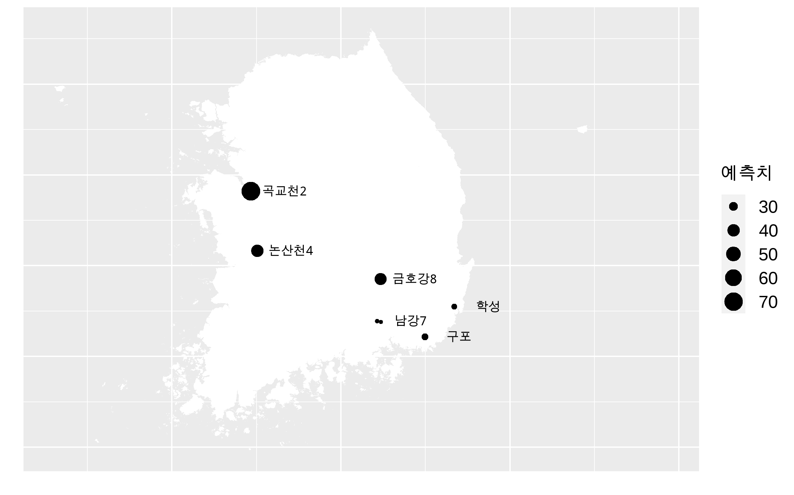
</center>

\newpage


##  3. 질문기반DB AUGUST

 3.질문기반DB의 내용은 KEI와 서울대학교 행정대학원이 공동으로 개발한 질문중심 DB에 기재된 내용에서 발췌하였다. 원자료는 이하에 기재한 웹사이트로부터 확인할 수 있다.

1. A.대기오염: https://147.47.206.193/SASVisualAnalytics/?reportUri=%2Freports%2Freports%2Ffec6424f-fa2c-4078-8ba5-31e491af1137&sectionIndex=0&sso_guest=true&sas-welcome=false 

2. B.기후변화: https://147.47.206.193/SASVisualAnalytics/?reportUri=%2Freports%2Freports%2F23681dc6-2802-4b43-bc8e-636d1154733a&sectionIndex=0&sso_guest=true&sas-welcome=false

3. C. 탄소중립 
  + 한국: https://lookerstudio.google.com/reporting/3d1b7550-d95b-4cef-aa6b-13f66ca6a5e4 
  + 국제: https://lookerstudio.google.com/reporting/5049004e-23dc-4da8-a7dc-040c95ce30a3  


#### A. 대기오염

그림 3-1은 2010년 1월 이후 6개 대기오염물질에 대해서 전국 대기오염 측정소의 오염도 월평균값의 전국 평균을 보여주는 그림이다. 이 그림은 대기오염물질 오염도의 전국적인 추이를 나타낸다. 그림에서 알 수 있듯이 2023년에도 오존을 제외한 모든 대기오염물질의 오염도는 전반적인 하락 추세를 유지하고 있다. 

<center>
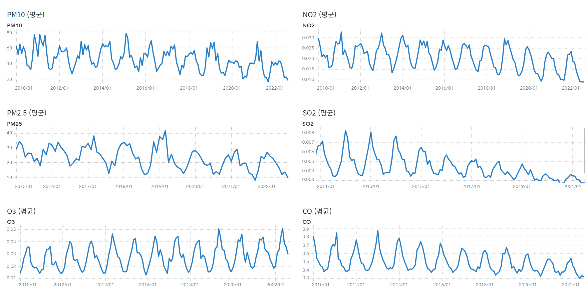
</center>

#### B.기후변화

그림 3-2는 1970년부터 2023년까지 기상 관측소의 연평균 기온의 평균값의 추이를 나타낸 그림이다. 이 그림으로부터 장기적인 기온 상승 추이는 2023년에도 지속되고 있음을 알 수 있다. 이렇게 연평균 기온의 추이를 반영한다면 2024년에도 기온의 상승은 지속되어 연평균 기온이 2022년 13.14에서 2025년 13.21로 상승할 전망이다. 그림 3-3은 연간 기온 상승 추이를 반영한 연평균 기온 전망치를 보여준다.  


<center>
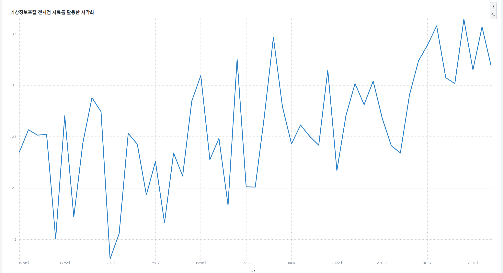
</center>

<center>
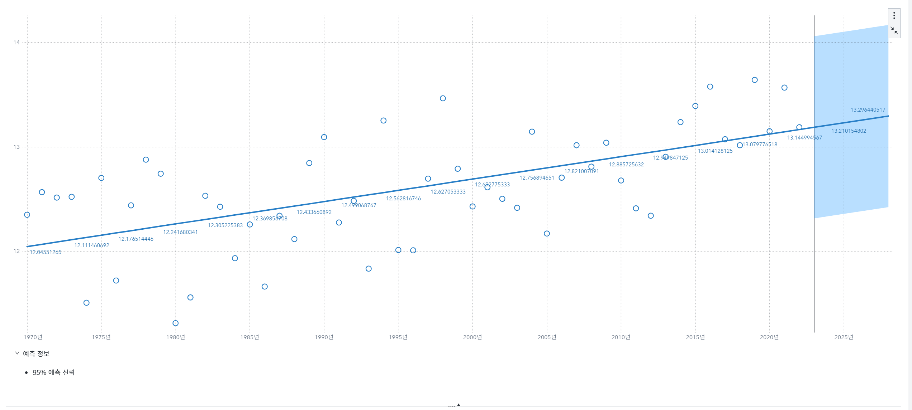
</center>

#### C.탄소중립

그림 3-4의 왼쪽 그림은 2010년-2019년간 한국의 온실가스 배출량, 오른쪽 그림은 같은 기간 한국의 온실가스 배출량 증가율을 보여준다. 2010년 이후에도 꾸준한 증가 추세를 유지하던 총배출량이 2019년에는 전년 대비 감소하였음을 알 수 있다.

```{r GHGEMISSION,,echo=FALSE,include=FALSE}

GHG=read_excel("./QDB/KEI_탄소중립(국가)_대한민국 온실가스 배출량_선 차트.xlsx") %>%
  mutate(Zero=0)%>%
  pivot_longer(-Year, names_to="NAME",values_to="VALUE")

P_GHG= GHG %>% 
  filter(NAME=="총배출량") %>%
  filter(Year>=2010) %>%
  ggplot(aes(x=Year,y=VALUE)) +
  geom_line() +
  geom_point()
#print(P_GHG)
ggsave("GHG.png")

P_GHGg= GHG %>% 
  filter(NAME!="총배출량") %>%
  filter(!is.na(VALUE)) %>%
  filter(Year>=2010) %>%
  ggplot(aes(x=Year,y=VALUE,color=NAME)) +
  geom_line() +
  geom_point(aes(size=NAME))+
  scale_size_manual(values=c(0,1))+
  scale_color_manual(values=c("red","black"))+
  theme(legend.position = "none")

P_GHGALL=ggarrange(P_GHG,P_GHGg,ncol=2,nrow=1)
#print(P_GHGg)
ggsave("GHGALL_08.png")
```

<center>
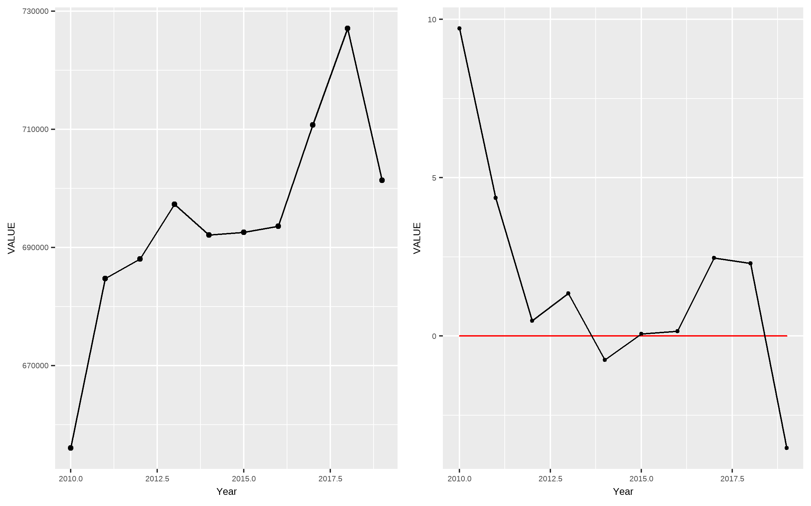
</center>

```{r GHGEMISSIONPART,,echo=FALSE,include=FALSE}

GHGPART=read_excel("./QDB/KEI_탄소중립(국가)_분야별 오염물질별 온실가스 배출량.xlsx") 


P_GHGpart= GHGPART %>% 
  filter(Year>=2010) %>%
  rename("EMIT"="분야별 배출량") %>%
  ggplot(aes(x=Year,y=EMIT)) +
  geom_line() +
  geom_point()+
  facet_wrap(~분야)
#print(P_GHG)
ggsave("GHGpart.png")

P_GHGPartg= GHGPART %>%
  filter(Year>=2010) %>%
  rename("EMIT"="분야별 배출량") %>%
  mutate(zero=0) %>%
  #
  group_by(분야) %>%
  mutate(EMITg=100*((EMIT-lag(EMIT))/lag(EMIT)))%>%
  filter(!is.na(EMITg)) %>%
  filter(분야!="LULUCF") %>%
  filter(분야!="간접배출량")%>%
  select(-EMIT)%>%
  pivot_longer(zero:EMITg,names_to="NAME",values_to="VALUE")%>%
  ggplot(aes(x=Year,y=VALUE, color=NAME)) +
  geom_line() +
  geom_point(aes(size=NAME))+
  scale_size_manual(values=c(1,0)) +
  scale_color_manual(values=c("black","red"))+
  facet_wrap(~분야)+
  theme(legend.position = "none")

ggsave("GHGpartg_08.png")
```

그림 3-5는 2010년-2019년 부문별 온실가스 배출량 증감률을 보여준다. 그림 3-6으로부터 전 부문에서 음의 증감률이 나타난 시기는 2019년이 처음임을 알 수 있다. 이 추세가 지속될지 여부는 이후의 자료를 이용하여 지속적으로 추적할 필요가 있다. 단, 산업부문과 폐기물 부문에서는 2018년부터 증감률이 음의 값을 가지고 있어서 감소추세가 일찍 시작되었음을 보여준다. 코로나 19로 인한 사회적 거리두기는 2020년에 시작되었기 때문에 이 시기의 배출량에는 영향을 주었다고 보기 어렵다. 

<center>
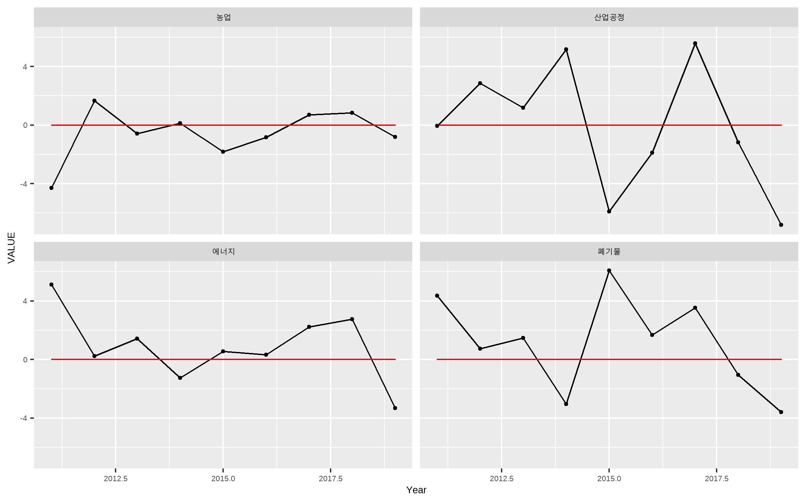
</center>

```{r GHGEMISSIONWORLD,,echo=FALSE,include=FALSE}

GHGWORLD=read_excel("./QDB/KEI_탄소중립(국제)_오염물질 및 온실가스 추세.xlsx") 
GHGWORLD$GGE_90=as.numeric(GHGWORLD$GGE_90)


P_GHGWORLD= GHGWORLD %>% 
  filter(Year==2018) %>%
  #rename("EMIT"="분야별 배출량") %>%reorder(column1,±column2)
  ggplot(aes(x=reorder(Country,GGE_90),y=GGE_90)) +
  geom_col() +
  geom_label(aes(label=round(`GGE_90`,2)),
            size=5)+
            #position= position_stack(vjust=0.5),
            #color="white")+
            #color="white")+
  labs(#size = "클로로필_A 예측치",
       x="증감율",
       y="(%)")+
       #title="녹조 위험 예고 지역") 
  theme(axis.text=element_text(size=20))
  
#print(P_GHG)
ggsave("GHGWORLD_08.png")


```


그림 3-5에서 보여주는 성과에도 불구하고 한국은 1990년-2018년간 세계적으로 가장 빠르게 온실가스 배출량이 증가한 국가이기도 하다. 그림 3-6은 1990년 대비 2018년 국가 별 온실가스 배출량 증감율(%)을 비교하고 있다. 비교 대상 국가 중 한국은 중국에 이어서 두번째로 크게 증가하였음을 알 수 있다. 

<center>
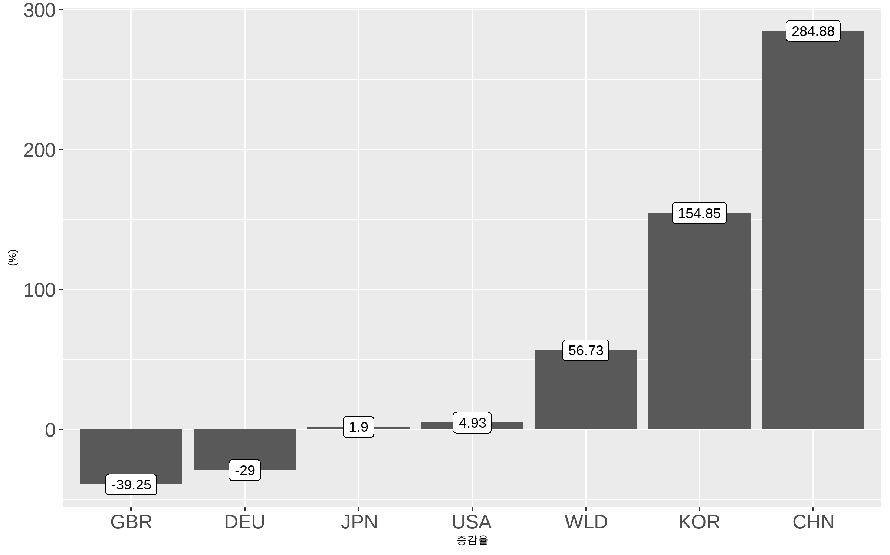
</center>
\newpage

# 9월 환경 빅데이터 뉴스레터

##  1. 텍스트분석 SEPTEMBER

* 한국환경연구원 텍스트 수집 도구는 2023년 9월 30일까지 네이버 기사 데이터와 환경부 문헌 데이터를 제공한다. 아래 뉴스레터에서는 2023년 9월 1일을 기점으로 30일 이전까지 수집한 자료를 사용한다. 


#### A. Text 데이터  


분석 대상 Text Data는 다음 두 종류의 문헌을 자료이다. 


1. NAVER 환경 뉴스 : 2023년 9월 1일-2023년 9월 30일 NAVER 뉴스> '사회' >'환경' 부문에 게시된 뉴스
2. 환경부 문건 : 2023년 9월 1일-2023년 9월 30일 환경부홈페이지에 게시된 환경부 보도자료 및 e-환경뉴스

'NAVER 환경 뉴스'는 환경정책의 수요자인 국민의 환경과 관련된 관심사를 전달하는 텍스트 자료이다. 그리고 '환경부 문건'은 환경정책의 공급자인 환경부의 관심사를 전달하는 텍스트 자료이다. 이 두 자료의 키워드를 비교하여 환경정책 공급자의 관심사가 환경정책 수요자의 관심사에 조응하는지 여부를 점검한다.

#### B. 키워드 빈도분석

 한국환경연구원의 환경 빅데이터 플랫폼에서는 키워드를 단순빈도수 및 TF_IDF 값에 따라 추출한다. 키워드 추출 전단계로 파이선'konlpy'패키지를 활용한 형태소 분석 및 품사 태깅을 수행하고, 불용어(stopwords)를 제거한다.  2023년 8월 2일 - 8월 31일 게시 NAVER 환경뉴스 및 환경부 문건에서 단순빈도수가 높은 20개의 키워드를 추출한 결과는 아래 그림과 같다. 

```{r readdataOC, echo=FALSE}
NAVER_TF=read.csv("./Data/2023_10_04/2023-09-30_30_NN_TF.txt",
                  encoding="UTF-8",
                  row.names=NULL,
                  header=FALSE)[,-1]


NAVER_TFIDF=read.csv("./Data/2023_10_04/2023-09-30_30_NN_norm_TF.txt",
                  encoding="UTF-8",
                  row.names=NULL,
                  header=FALSE)[,-1]

ME_TF=read.csv("./Data/2023_10_04/2023-09-30_30_ME_TF.txt",
               encoding="UTF-8",
               row.names=NULL,
               header=FALSE)[,-1]

ME_TFIDF=read.csv("./Data/2023_10_04/2023-09-30_30_ME_norm_TF.txt",
               encoding="UTF-8",
               row.names=NULL,
               header=FALSE)[,-1]

colnames(NAVER_TF)=c("키워드","빈도수")

colnames(NAVER_TFIDF)=c("키워드","TFIDF")

colnames(ME_TF)=c("키워드","빈도수")

colnames(ME_TFIDF)=c("키워드","TFIDF")

NAVER_TF=tibble(NAVER_TF)
ME_TF=tibble(ME_TF)
NAVER_TFIDF=tibble(NAVER_TFIDF)
ME_TFIDF=tibble(ME_TFIDF)


```

```{r figOC,showtext=TRUE,echo=FALSE, warning =FALSE}
P_NAVFQ=NAVER_TF%>% head(n=20) %>%ungroup() %>% 
  ggplot(aes(x=`빈도수`,y=reorder(`키워드`,`빈도수`))) + 
  geom_col(show.legend=FALSE) +
  ggtitle("NAVER 환경뉴스")+ labs(y="")+
  geom_text(aes(label=`빈도수`),size=3.5,nudge_x = 18)+
  theme_grey(base_family = "nanum")
#print(P_NAVFQ)

P_MEFQ=ME_TF %>%  head(n=20) %>%ungroup() %>% 
  ggplot(aes(x=`빈도수`,y=reorder(`키워드`,`빈도수`))) + 
  geom_col(show.legend=FALSE) + 
  ggtitle("환경부 문건")+ labs(y="")+
  geom_text(aes(label=`빈도수`),size = 3.5,nudge_x = 3)+
  theme_grey(base_family = "nanum")


P_FQ=ggarrange(P_NAVFQ,P_MEFQ,ncol=2,nrow=1)

print(P_FQ)

```


눈에 띄는 특징은 다음과 같이 정리할 수 있다.  

* 첫째, 네이버 환경뉴스에는 빈도수가 높은 키워드와 환경부 문건에서 빈도수가 가장 높은 키워드가 '배출'로 일치하였다. 네이버 환경뉴스와 환경부 문건 모두 '배출'이 제목에 포함된 문건은 온실가스를 포함한 다양한 환경오염물질 배출과 관련된 문건들이었다.  

* 둘째, 네이버 환경뉴스에는 빈도수가 높은 상위 20개 키워드 중 '오염수','일본','방류','안전'이 발견되어 후쿠히마 원전 가동과 관련된 관심이 유지되었음을 시사하였으나, 환경부 문헌에서는 이에 상응하는 키워드는 발견되지 않았다. 이는 2023년 8월까지 지속된 현상이 유지되고 있음을 시사한다. 환경부 문건에서도 '안전' 키워드는 발견되었지만 이를 제목에 포함하는 환경부 문건은 후쿠시마 원전 가동과는 관련이 없었다.

* 셋째, 네이버 환경뉴스에는 빈도수가 높은 상위 20개 키워드 중 '기후','탄소','온실가스','기후변화','탄소 중립'와 같이 기후변화 관련  키워드가 발견되었으며 환경부 보도자료에도 이에 상응하는 '녹색','기후', '기후변화','탄소','온실가스','전기차','수소'와 같은 키워드가 발견되었다. 

* 넷째, 네이버 환경뉴스에는 빈도수가 높은 상위 20개 키워드 중 '플라스틱','자원','순환','폐기물','재활용'과 같이 폐기물 관련 키워드가 발견되었으며 환경부 보도자료에도 이에 상응하는 '폐기물','플라스틱'과 같은 키워드가 발견되었다. 

* 다섯째, 네이버 환경뉴스에는 빈도수가 높은 상위 20개 키워드 중 공공기관, 민간, 국가 간 환경 협력을 나타내는 '협약' 키워드가 발견되었으며 환경부 보도자료에도 이에 상응하는 '협약'키워드가 발견되었다. 

* 여섯째, 환경부 문건의 빈도수 상위 20개 키워드 중에는 '국립공원','아프리카'(아프리카 돼지열병),'야생','생물','멧돼지'와 같이 생태계와 관련된 키워드, 그리고 '청년','규제','요소'(요소수공급)
와 같이 다양한 환경정책 관련 키워드가 발견되지었지만, 네이버 환경뉴스에서는 이에 상응하는 키워드가 발견되지 않았다. 

```{r TFIDFFIGUREOC, message=FALSE, echo=FALSE, warning =FALSE}

P_NAVTFIDF=NAVER_TFIDF%>% head(n=20) %>%ungroup() %>% 
  ggplot(aes(x=TFIDF,y=reorder(`키워드`,TFIDF))) + 
  geom_col(show.legend=FALSE) + 
  ggtitle("NAVER 환경뉴스")+ labs(y="")+
  geom_text(aes(label=round(TFIDF,1)),size=3.5, nudge_x=2)+
  theme_minimal()
#+
  #theme_grey(base_family = "nanum")+ 
  #theme(text = element_text(size = 12)) 

P_METFIDF=ME_TFIDF %>%  head(n=20) %>%ungroup() %>% 
  ggplot(aes(x=TFIDF,y=reorder(`키워드`,TFIDF))) + 
  geom_col(show.legend=FALSE) + 
  ggtitle("환경부 문건")+ labs(y="")+
  geom_text(aes(label=round(TFIDF,1)),size=3.5, nudge_x=0.2)+
  theme_minimal()

#+
  #theme_grey(base_family = "nanum")+ 
  #theme(text = element_text(size = 12)) 


P_TFIDF=ggarrange(P_NAVTFIDF,P_METFIDF,ncol=2,nrow=1)
#P_TFIDF2=annotate_figure(P_TFIDF,
               #top = text_grob("Visualizing Tooth Growth", color = "red", face = "bold", size = 14),
#               bottom = text_grob("그림 2. TFIDF 키워드 순위 비교", x=0.2)#hjust = 1, x = 1),
               #left = text_grob("Figure arranged using ggpubr", color = "green", rot = 90),
               #right = text_grob(bquote("Superscript: ("*kg~NH[3]~ha^-1~yr^-1*")"), rot = 90),
               #fig.lab = "Figure 1", fig.lab.face = "bold"
#)


print(P_TFIDF)
#ggsave(file="P_TFIDF_220929_7.png",P_TFIDF)
#ggsave(file="P_NAVTFIDF.png",P_NAVTFIDF)
#ggsave(file="P_METFIDF.png",P_METFIDF)

```

이와 같은 경향은 TF_IDF 값이 높은 20개의 키워드를 추출하여 비교하여도 확인된다. Figure 2는 TF_IDF를 기준으로 추출한 상위 20개 키워드의 TF_IDF 값을 보여준다. Figure 2에서도 확인할 수 있듯이 

* '배출' 키워드는 NAVER 뉴스와 환경부 문건에서 가장 TF_IDF 값이 큰 키워드이다.

* '오염수','방류','바다','일본','후쿠시마','오염수 방류' 등 후쿠시마 원전 오염수 방류 관련 키워드는 NAVER 뉴스에서만 찾아볼 수 있다.

* '기후', '탄소','온실가스'와 같은 NAVER 뉴스의 키워드와 '전기차','녹색','기후','온실가스','기후변화'와 같은 환경부 문건의 키워드는 기후변화와 대한 민간의 관심과 환경부의 관심이 상호 일치함을 보여준다.

* '플라스틱','자원','순환','자원 순환','쓰레기','폐기물'과 같은 NAVER 뉴스의 키워드와 '폐기물','플라스틱'과 같은 환경부 문건의 키워드는 폐기물에 대한 민간의 관심과 환경부의 관심이 상호 일치함을 보여준다.

* '국립공원','야생','아프리카','멧돼지'와 같은 자연환경과 관련된 키워드, '청년','규제'와 같은 환경정책 관련 키워드는 환경부 문건에서만 찾아 볼 수 있다. 


#### C. 키워드 관련 뉴스


네이버 환경뉴스 키워드와 환경부 문건 키워드간의 차이의 원인을 파악하기 위해서 두 문헌에서 단순빈도가  가장 높은 10개 키워드 중 서로 상이한 키워드가 포함된 문헌의 제목들을 비교하였다. 

* 네이버 환경뉴스에서 단순빈도가 높은 10개 키워드 중 환경부 문건의 단순빈도가 높은 20개 키워드에 포함되지 않은 키워드는 [`r setdiff(NAVER_TF$키워드[1:10],ME_TF$키워드[1:20])`]이다. 이들 중 '자원'은 자원순환에 관련된 키워드로서 환경부 문헌의 '폐기물', '플라스틱' 등 폐기물 관련 키워드들과 연관이 있다. 

* 환경부 문헌에서 단순빈도가 높은 10개 키워드 중 네이버 환경뉴스에서  단순빈도가 높은 20개 키워드에 포함되지 않은 키워드는 [`r setdiff(ME_TF$키워드[1:10],NAVER_TF$키워드[1:20])`]이다. 이들 중 '녹색','전기차'는 기후변화에 관련된 키워드로서 네이버 환경뉴스의 '기후', '탄소' 등 기후변화 관련 키워드들과 연관이 있다. 


```{r titleloadOC, echo=FALSE, warning =FALSE}
#library(readxl)
#read_excel
#TITLE_NN_7=read.csv("./Data/2022-09-29_7_NN_idx.txt",header=FALSE) 
#TITLE_ME_7=read.csv("./Data/2022-09-29_7_ME_idx.txt",header=FALSE) 
#TITLE_NN_14=read.csv("./Data/2022-09-29_14_NN_idx.txt",header=FALSE) 
#TITLE_ME_14=read.csv("./Data/2022-09-29_14_ME_idx.txt",header=FALSE) 
TITLE_NN_30=read.csv("./Data/2023_10_04/2023-09-30_30_NN_idx.txt",header=FALSE) 
TITLE_ME_30=read.csv("./Data/2023_10_04/2023-09-30_30_ME_idx.txt",header=FALSE) 

# TITLE_NN_7$GAP=7
# TITLE_ME_7$GAP=7
# 
# TITLE_NN_14$GAP=14
# TITLE_ME_14$GAP=14

TITLE_NN_30$GAP=30
TITLE_ME_30$GAP=30

TITLE_NN=TITLE_NN_30 %>% select(c("V3","GAP")) %>% mutate(SOURCE="NAVER")
TITLE_ME=TITLE_ME_30 %>% select(c("V3","GAP")) %>% mutate(SOURCE="ME")
TITLES =rbind(TITLE_NN,TITLE_ME)
colnames(TITLES)=c("Title","GAP","SOURCE")
```


1. '방류','오염수', '일본'을 제목에 포함하는 기사들은 후쿠시마 제1원자력발전소 오염수 방류와 관련된 기사로 파악되었다. '재판매'를 제목에 포함하는 기사는 존재하지 않았다. 

```{r title1OC, echo=FALSE, warning =FALSE}
#TITLES=read_excel("./Data/titles_20230417.xlsx",sheet=1)
#TITLES=TITLES %>% mutate(ID=1) %>% group_by(KEY) %>% mutate(SE=cumsum(ID)) %>% filter(SE<=3)
R1=TITLES %>% filter(SOURCE=="NAVER") %>%
  filter(GAP==30) %>%
  #filter(str_detect(Title,"오염수")) %>%
  filter(str_detect(Title,"오염수")|
           str_detect(Title,"방류")|
           str_detect(Title,"일본")
           ) %>%
  select(Title) %>% 
  head(15)

kable(R1)

```


환경부 문헌에서 가장 빈도가 높은 10개 키워드 중 네이버 뉴스에서 가장 빈도가 높은 키워드 20개에 포함되지 않은 키워드는 '청년','녹색','국립공원','전기차','야생' 이다. 이 중 '녹색','전기차'는 네이버 뉴스의 키워드 중 '기후'에 조응한다. 그 외의 키워드에 조응하는 네이버 뉴스 키워드는 찾아보기 어렵다. 2023년 9월 1일부터 9월 30일까지 게시된 환경부 문헌 중 이들 키워드를 제목에 포함하는 환경부 문헌은 다음과 같다. 

1. '청년' 을 제목에 포함하는 문헌은 3건으로 환경정책에 청년들의 의견을 반영하거나 청년들에게 참여 기회를 제공하는 정책 관련 문헌이었다. 
```{r titleME1OC, echo=FALSE, warning =FALSE}
R1_ME=TITLES %>% filter(SOURCE=="ME") %>%
  filter(GAP==30) %>%
  filter(str_detect(Title,"청년")) %>%
  #filter(!str_detect(Title,"기후"))%>%
  select(Title)
kable(R1_ME)

```
2. '국립공원','야생' 을 제목에 포함하는 문헌은 8건이었는데 5건은 국립공원 이용 관련 문헌이었고,1건은 아프리카돼지열병 관련 문헌이었으며, 2건은 야생조류 조류인플루엔자 관련 문헌이었다. 모두 자연환경 관련 문헌이었다.

```{r titleME2OC, echo=FALSE, warning =FALSE}
R1_ME=TITLES %>% filter(SOURCE=="ME") %>%
  filter(GAP==30) %>%
  filter(str_detect(Title,"국립공원")|
          str_detect(Title,"야생") ) %>%
  #filter(!str_detect(Title,"기후"))%>%
  select(Title)
kable(R1_ME)

```

#### D. 정리

2023년 9월 1일-2023년 9월 30일 게시된 네이버 환경뉴스와 환경부 문헌을 비교한 결과를 요약하면 다음과 같다.


1. 네이버 기사에는 후쿠시마 원전 오염수와 관련된 키워드가 출현하였지만 환경부 문헌에서는 이에 조응하는 키워드가 발견되지 않았다. 이는 2023년 8월까지의 키워드 분석 결과와 일관된 결과이다. 

2. 환경부 문헌에는 자연환경 및 환경정책 관련 키워드가 출현하였지만 네이버 뉴스에서는 이에 조응하는 키워드가 발견되지 않았다.

3. 네이버 기사와 환경부 문헌 모두 환경오염물질의 배출, 기후변화, 그리고 폐기물 관련 키워드가 출현하였다. 이는 기후변화 및 폐기물과 관련된 민간의 관심과 정부의 개입이 조응하고 있음을 시사한다.


\newpage

##  2. 녹조예측 SEPTEMBER
```{r dataOC, echo=FALSE}
STATIONINFO=read_excel("./predict_chroro/CHARACTER_2023.xlsx",sheet=1)
COVEREDSTATION=STATIONINFO$Kname[!is.na(STATIONINFO$Kname)]

## Data Prep
#1. Read data
CHRORO.Data=read.csv(file="./predict_chroro/predictions.csv",fileEncoding = "euc-kr")
colnames(CHRORO.Data)=gsub("[[:punct:]]", "",colnames(CHRORO.Data))
CHRORO.Date=str_split_fixed(CHRORO.Data$예측일자,fixed("."),3) %>% 
  data.frame()
colnames(CHRORO.Date)=c("YEAR","MONTH","WEEK")

CHRORO_YMW=CHRORO.Date %>%
  mutate(NYEAR=as.numeric(YEAR),
         NMONTH=as.numeric(MONTH),
         WEEK2=str_sub(WEEK,1,1)) %>%
  mutate(NWEEK=as.numeric(WEEK2)) %>%
  select(NYEAR,NMONTH,NWEEK)

CHRORO_full = cbind(CHRORO.Data, CHRORO_YMW) %>%
  select(c("측정소명","NYEAR","NMONTH","NWEEK","Prediction","Actual")) 

#Add characteristics
CHRORO_CH=CHRORO_full %>%
  left_join(STATIONINFO,by=c("측정소명"="Ename"))

```


#### A. Data 

분석 대상 Data는 2023년 "환경 빅데이터 분석 및 서비스 개발" 과제에서 구축한 녹조 예측 CNN 모형의 Chlorophyll-a 예측치이다. 이 모형은 2016년부터 2022년까지의  수질오염도 자료를 이용하여 1주 이후의 Chlorophyll-a 농도를 예측한다. 예측의 대상은 안정적으로 물환경정보시스템의 API 계정을 통해 데이터를 확보할 수 있는  `r length(COVEREDSTATION)` 수질오염자동측정소이다. 

* 예측 대상 측정소 : `r COVEREDSTATION`


#### B. 예측결과


```{r predictiondayOC,echo=FALSE}
# Choose latest date
Pred_CH=CHRORO_CH %>% 
  filter(is.na(Actual)) %>% # dates with only predicted values
  group_by(Kname) %>%
  mutate(MaxY=max(NYEAR)) %>%
  filter(NYEAR==MaxY) %>%
  group_by(측정소명,NYEAR) %>%
  mutate(MaxM = max(NMONTH)) %>%
  filter(NMONTH==MaxM) %>%
  group_by(측정소명, NYEAR,NMONTH) %>%
  mutate(MaxW=max(NWEEK)) %>%
  filter(NWEEK==MaxW) %>%
  group_by(측정소명,NYEAR,NMONTH,NWEEK) %>%
  mutate(MaxP=max(Prediction)) %>%
  filter(Prediction==MaxP)

         


WARNINGSPOT=Pred_CH %>% 
  filter(Prediction>25) %>% 
  ungroup() %>% 
  select(c("Kname","NYEAR","NMONTH","NWEEK","Prediction")) %>% 
  arrange(desc(Prediction)) 
colnames(WARNINGSPOT)=c("측정소","년도","월","주","예측치")
WARNINGSPOT$예측시점 = paste(WARNINGSPOT$년도,WARNINGSPOT$월,WARNINGSPOT$주, sep="-" )
WARNINGSPOT_simple= WARNINGSPOT %>% ungroup() %>% select(-c("년도","월","주"))
#kable(WARNINGSPOT)

```


각 측정소에서 예측 가능한 최근 시점에 Chlorophyll-a 예측치가 25$\mu g/m^3$ 이상이어서 녹조 농도가 높을 것으로 예측되는 측정소는 아래의 표에 수록한 `r dim(WARNINGSPOT)[1]`개 측정소이다. 아래 표의 각각의 행에 수록된 변수의 정의는 다음과 같다.

* 측정소 : 예측의 대상인 측정소
* 예측시점 : 예측 가능한 최근 시점
* 예측치 : 예측시점의 Chlorophyll-a 예측치


```{r Report1OC,echo=FALSE}
kable(WARNINGSPOT_simple)
```


위의 표에 수록된 측정소의 위치를 지도에 표시하면 다음과 같다. 점의 크기가 클 수록 예상 녹조 농도가 높은 측정소이다. 
```{r ReportmapOC,echo=FALSE,include=FALSE}
WARNINGSPOT_LOC=left_join(WARNINGSPOT_simple,STATIONINFO,by=c("측정소"="Kname")) 
#%>%
  #mutate(REPORT=paste(Kname,round(ChloA_P,1),sep="_"))

# Draw Warning post on the map
## load map (http://www.gisdeveloper.co.kr/?p=2332)# 2022.3.Update
map=readOGR("./predict_chroro/CTPRVN_20220324/ctp_rvn.shp")

#Change coordinate to longitude/latitude
ls_crs = list(wgs84="+proj=longlat + ellps=WGS84 +datum=WGS84 +no_defs")
map = spTransform(map,CRSobj=CRS(ls_crs$wgs84))

#map@polygons[[1]]@Polygons[[1]]@coords[1:4,]

#df_map_data=map@data
#head(df_map_data,2)

df_map = fortify(map)
df_map = df_map %>% filter(id!="16")
#head(df_map)
p=ggplot(data=df_map,
       aes(x=long,y=lat,group=group))+
  geom_polygon(fill="#FFFFFF",
               color="#000000",
               linetype=0)+ # dotted line
  geom_point(data=WARNINGSPOT_LOC,
             aes(x=Longitude,y=Latitude,size=`예측치`),
             inherit.aes = FALSE) +
  geom_text(data=WARNINGSPOT_LOC,
            aes(x=Longitude,y=Latitude),
            label=WARNINGSPOT_LOC$`측정소`,
            nudge_x=0.4,
            inherit.aes = FALSE,
            size = 5,
            check_overlap = TRUE)+
#,
            #check_overlap = TRUE) 
  labs(#size = "클로로필_A 예측치",
       x="",
       y="")+
       #title="녹조 위험 예고 지역") +
  theme(axis.ticks.x=element_blank(),
        axis.text.x=element_blank(),
        axis.ticks.y=element_blank(),
        axis.text.y=element_blank(),
        legend.title=element_text(size=20),
        legend.text=element_text(size=20))
```

```{r Reportmap2OC,include=FALSE}
#print(p)
ggsave("Highchol_P_20231005.png",p)
```
<center>
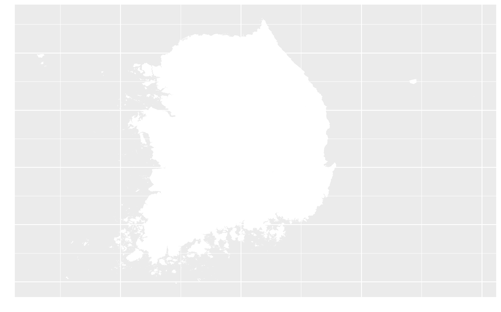
</center>

\newpage


##  3. 질문기반DB SEPTEMBER

 3.질문기반DB의 내용은 KEI와 서울대학교 행정대학원이 공동으로 개발한 질문중심 DB에 기재된 내용에서 발췌하였다. 원자료는 이하에 기재한 웹사이트로부터 확인할 수 있다.

1. A.대기오염: https://147.47.206.193/SASVisualAnalytics/?reportUri=%2Freports%2Freports%2Ffec6424f-fa2c-4078-8ba5-31e491af1137&sectionIndex=0&sso_guest=true&sas-welcome=false 

2. B.기후변화: https://147.47.206.193/SASVisualAnalytics/?reportUri=%2Freports%2Freports%2F23681dc6-2802-4b43-bc8e-636d1154733a&sectionIndex=0&sso_guest=true&sas-welcome=false

3. C. 탄소중립 
  + 한국: https://lookerstudio.google.com/reporting/3d1b7550-d95b-4cef-aa6b-13f66ca6a5e4 
  + 국제: https://lookerstudio.google.com/reporting/5049004e-23dc-4da8-a7dc-040c95ce30a3  


#### A. 대기오염

그림 3-1의 왼쪽 그래프는 2014년부터 2022년까지 광역지자체 연평균 PM10농도와 1인당소비 간의 상관관계를 보여주고, 오른쪽 그래프는 같은 기간 광역지자체 연평균 PM10농도와 평균소비성향 간의 관계를 보여준다. 그림 3-1은 PM10 농도와 1인당 소비 간에는 약한 음의 상관관계가 있지만, PM10 농도와 평균소비성향 간에는 미약한 양의 상관관계가 있음을 보여준다. 평균소비성향이 소득 중에서 소비가 차지하는 비중임을 고려하면, 그림 3-1의 왼쪽 그래프는 PM10 농도가 높은 광역지자체의 소득 수준이 낮은 경향이 있음을 암시한다. 그림 3-1에서 관찰되듯이, 미세먼지가 민간 소비에 미치는 영향은 일률적이지 않다.  

<center>
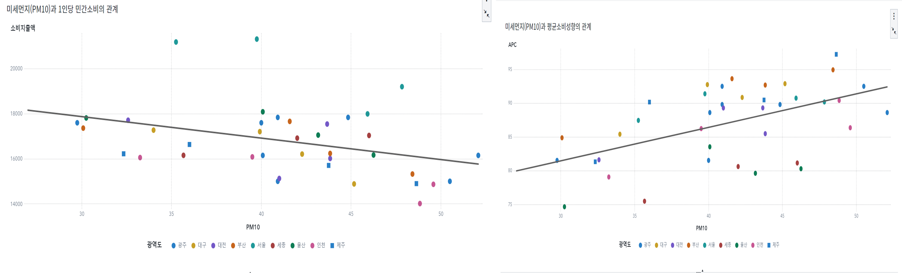
</center>

#### B.기후변화

그림 3-2는 1970년부터 2022년까지 연평균 강수량 추이를 보여주고 그림 3-3은 같은 기간 연평균 일조시수의 추이를 보여준다. 지속적인 기온 상승 추세와는 달리 강수량 및 일조시수는 뚜렷한 장기적인 추이를 보여주지 않고 있다. 강수량은 거의 추세가 관찰되지 않으며, 일조시수의 경우는 단기적으로 2005년 이후 증가 추세를 보여주고 있기는 하지만 이는 2000~2005년 기간의 하락 추세의 반등 효과라고 볼 수 있다.


<center>
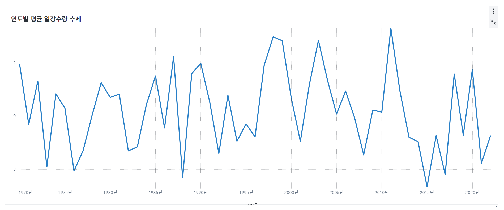
</center>

<center>
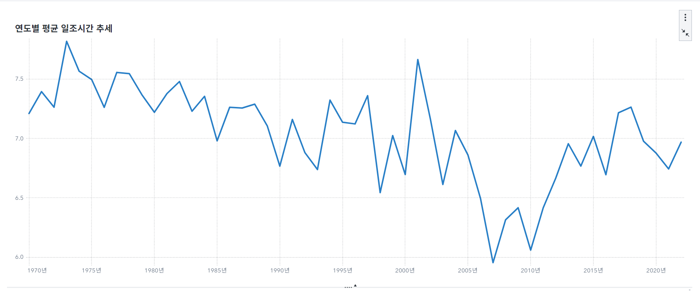
</center>

#### C.탄소중립

그림 3-4의 왼쪽 그림은 2010년-2019년간 한국의 온실가스 배출량, 오른쪽 그림은 같은 기간 한국의 온실가스 배출량 증가율을 보여준다. 2010년 이후에도 꾸준한 증가 추세를 유지하던 총배출량이 2019년, 2020년 2년간 전년 대비 감소하였음을 알 수 있다.

```{r GHGEMISSIONOC,,echo=FALSE,include=FALSE}

GHG=read_excel("./QDB/KEI_탄소중립(국가)_대한민국 온실가스 배출량_선 차트_202309.xlsx") %>%
  mutate(Zero=0)%>%
  pivot_longer(-Year, names_to="NAME",values_to="VALUE")

P_GHG= GHG %>% 
  filter(NAME=="총배출량") %>%
  filter(Year>=2010) %>%
  ggplot(aes(x=Year,y=VALUE)) +
  geom_line() +
  geom_point(size=1)
#print(P_GHG)
ggsave("GHG.png")

P_GHGg= GHG %>% 
  filter(NAME!="총배출량") %>%
  filter(!is.na(VALUE)) %>%
  filter(Year>=2010) %>%
  ggplot(aes(x=Year,y=VALUE,color=NAME)) +
  geom_line() +
  geom_point(aes(size=NAME))+
  scale_size_manual(values=c(0,1))+
  scale_color_manual(values=c("red","black"))+
  theme(legend.position = "none")

P_GHGALL=ggarrange(P_GHG,P_GHGg,ncol=2,nrow=1)
#print(P_GHGg)
ggsave("GHGALL.png")
```

<center>
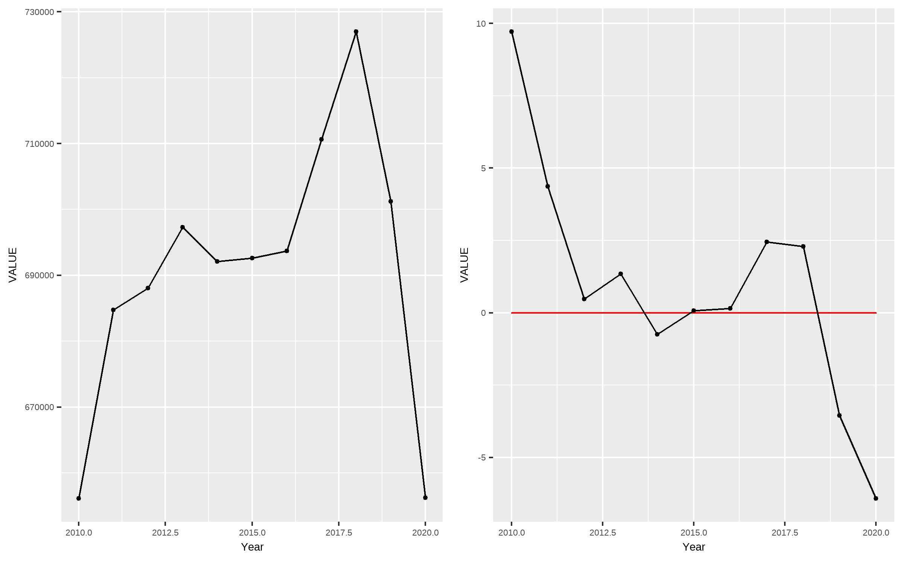
</center>

```{r GHGEMISSIONPARTOC,,echo=FALSE,include=FALSE}

GHGPART=read_excel("./QDB/KEI_탄소중립(국가)_분야별 오염물질별 온실가스 배출량_202309.xlsx") 


# P_GHGpart= GHGPART %>% 
#   filter(Year>=2010) %>%
#   rename("EMIT"="분야별 배출량") %>%
#   ggplot(aes(x=Year,y=EMIT)) +
#   geom_line() +
#   geom_point()+
#   facet_wrap(~분야)
#print(P_GHG)
ggsave("GHGpart.png")

P_GHGPartg= GHGPART %>%
  filter(Year>=2010) %>%
  rename("EMITg"="분야별 증감률") %>%
  mutate(zero=0) %>%
  pivot_longer(EMITg:zero,names_to="NAME",values_to="VALUE")%>%
  #group_by(분야) %>%
  #mutate(EMITg=100*((EMIT-lag(EMIT))/lag(EMIT)))%>%
  #filter(!is.na(EMITg)) %>%
  filter(분야!="LULUCF") %>%
  filter(분야!="간접배출량")%>%
  ggplot(aes(x=Year,y=VALUE, color=NAME)) +
  geom_line() +
  geom_point(aes(size=NAME))+
  scale_size_manual(values=c(1,0)) +
  scale_color_manual(values=c("black","red"))+
  facet_wrap(~분야)+
  theme(legend.position = "none")


ggsave("GHGpartg.png")
```

그림 3-5는 2010년-2020년 부문별 온실가스 배출량 증감률을 보여준다. 그림 3-6으로부터 2019년에는 전 부문에서 음의 증감률이 나타났음을 알 수 있다. 이 추세는 에너지 및 산업공정 부문에서는 2020년까지는 지속되었지만, 농업 및 폐기물 부문에서는 반전되었다. 산업부문에서는 2018년 이후의 감소세가 지속되었지만, 폐기물 부문에서는 2018년부터 시작된 감소세가 2020년에는 반전되었다. 코로나 19로 인한 사회적 거리두기는 2020년에 시작되었기 때문에 2019년 전 부문 배출량 감소는 코로나 19의 영향이라고 보기는 어렵지만, 2020년의 에너지 및 산업공정 부문 배출량 감소는 코로나 19의 영향을 반영한다.

<center>
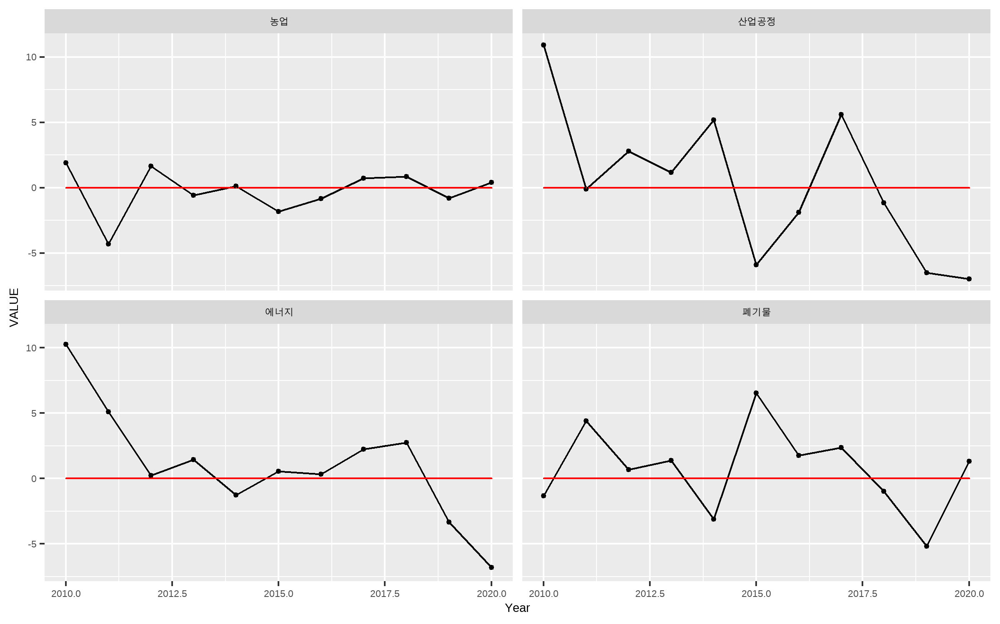
</center>

```{r GHGEMISSIONWORLDOC,,echo=FALSE,include=FALSE}

GHGperY=read_excel("./QDB/KEI_탄소중립(국가)_에너지 집약도 분석_202309.xlsx") %>%
  mutate(zero=0) %>%
  pivot_longer(-1,names_to="NAME",values_to="VALUE") %>%
  filter(!is.na(VALUE)) %>%
  rename("Year"="연도")
#GHG$GGE_90=as.numeric(GHGWORLD$GGE_90)

P_GHGperY= GHGperY %>% 
  filter(NAME=="GDP당 배출량") %>%
  filter(Year>=2010) %>%
  ggplot(aes(x=Year,y=VALUE)) +
  geom_line() +
  geom_point(size=1)
#print(P_GHG)
ggsave("GHGperY.png")

P_GHGperYg= GHGperY %>% 
  filter(NAME!="GDP당 배출량") %>%
  filter(!is.na(VALUE)) %>%
  filter(Year>=2010) %>%
  ggplot(aes(x=Year,y=VALUE,color=NAME)) +
  geom_line() +
  geom_point(aes(size=NAME))+
  scale_size_manual(values=c(1,0))+
  scale_color_manual(values=c("black","red"))+
  theme(legend.position = "none")

P_GHGperYALL=ggarrange(P_GHGperY,P_GHGperYg,ncol=2,nrow=1)
ggsave("GHGperYALL.png")
#print(P_GHGg)


```


그림 3-6은 한국의 2010년 이후 GDP 대비 배출량의 추이를 보여준다. 총배출량의 추이와는 달리 2011년을 고비로 GDP 대비 배출량은 감소세가 지속되고 있다. 이는 한국의 경우 2012년 이후에는 '탈동조화' 현상이 나타나고 있음을 시사한다.   

<center>
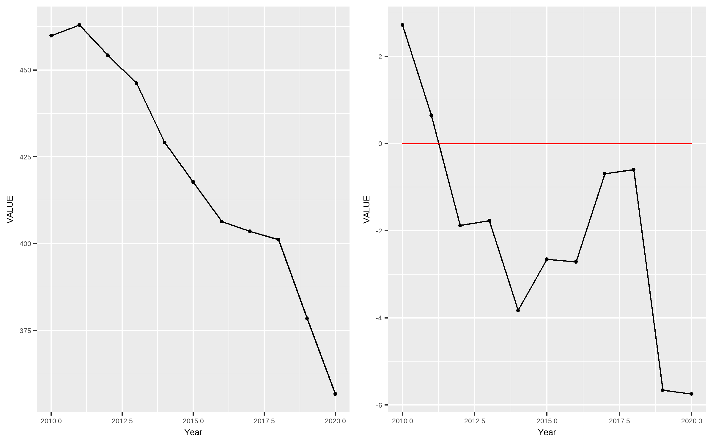
</center>